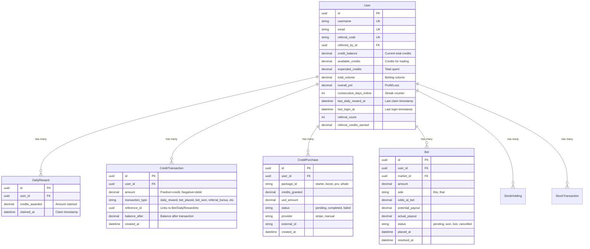
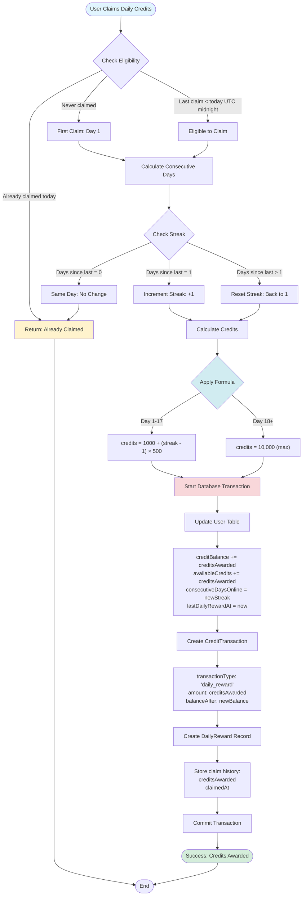
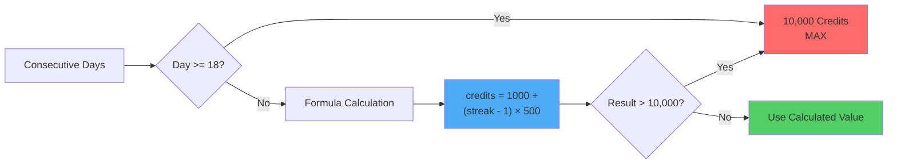
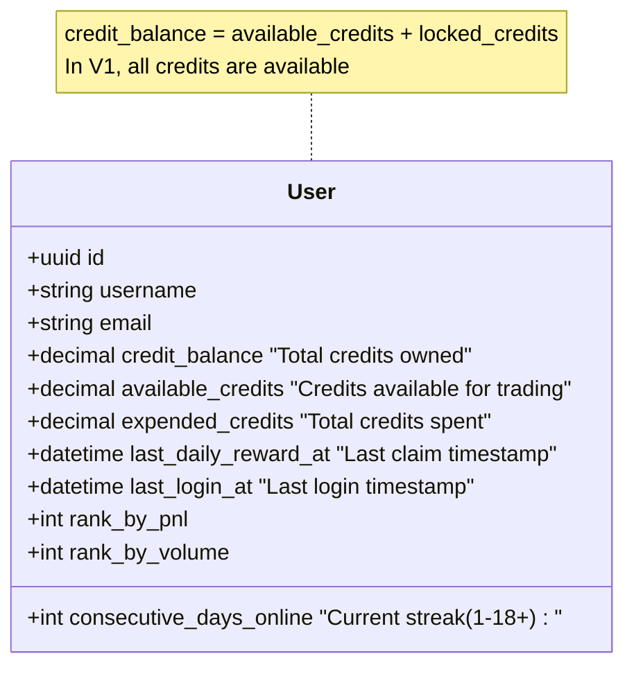
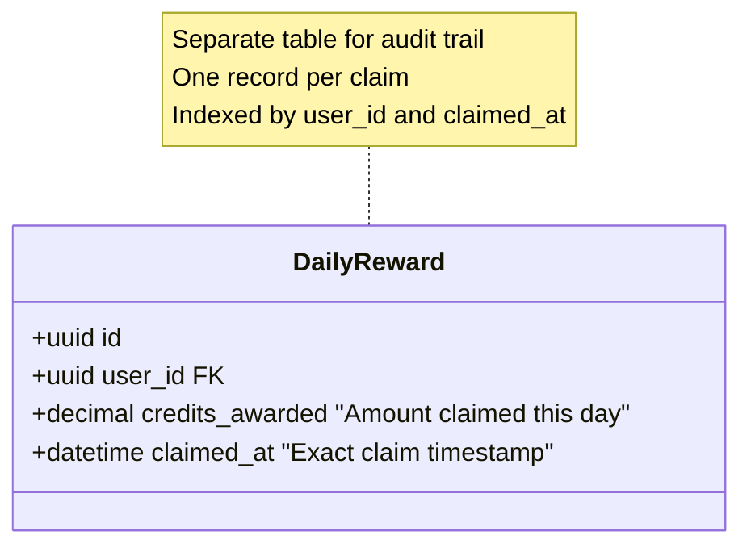
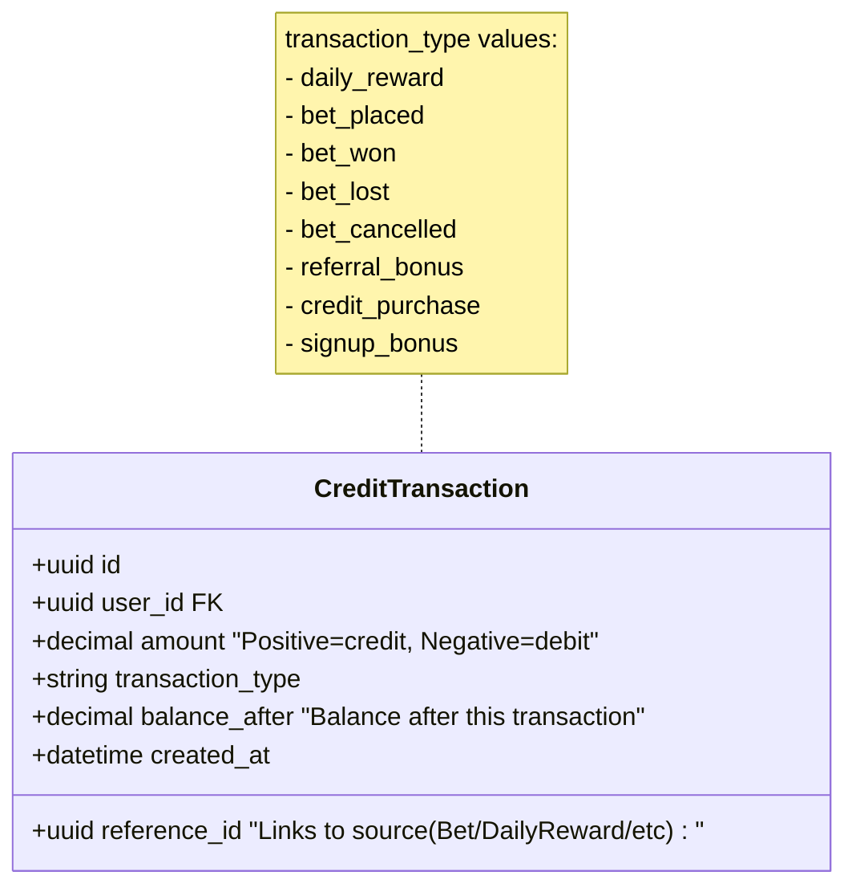
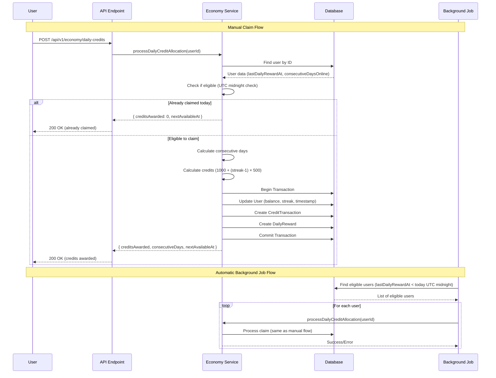
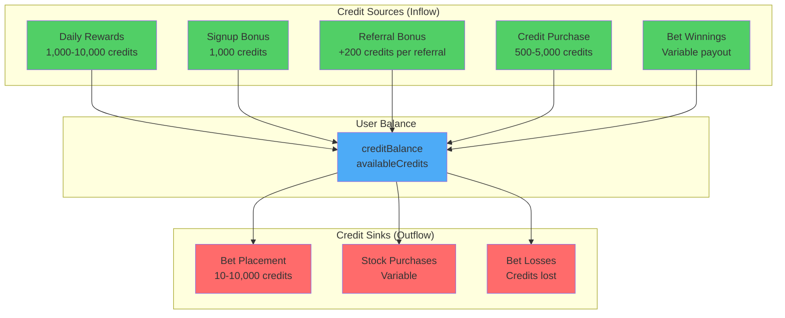

# Credit Allocation Schema & Structure

## Overview

The credit allocation system uses **three main tables**:
1. **`users`** - Stores current credit balances and streak tracking
2. **`daily_rewards`** - Separate table tracking each daily claim
3. **`credit_transactions`** - Complete audit trail of all credit movements

---

## Database Schema Diagram



---

## Credit Allocation Flow Diagram



---

## Credit Allocation Formula



---

## Credit Allocation Timeline

```mermaid
gantt
    title Daily Credit Allocation Streak System
    dateFormat YYYY-MM-DD
    axisFormat Day %d
    
    section Streak Progression
    Day 1: 1,000 credits    :done, day1, 2025-01-01, 1d
    Day 2: 1,500 credits    :done, day2, 2025-01-02, 1d
    Day 3: 2,000 credits    :done, day3, 2025-01-03, 1d
    Day 4: 2,500 credits    :done, day4, 2025-01-04, 1d
    Day 5: 3,000 credits    :done, day5, 2025-01-05, 1d
    Day 6: 3,500 credits    :active, day6, 2025-01-06, 1d
    Day 7: 4,000 credits    :day7, 2025-01-07, 1d
    Day 8: 4,500 credits    :day8, 2025-01-08, 1d
    Day 9: 5,000 credits    :day9, 2025-01-09, 1d
    Day 10: 5,500 credits   :day10, 2025-01-10, 1d
    Day 11: 6,000 credits   :day11, 2025-01-11, 1d
    Day 12: 6,500 credits   :day12, 2025-01-12, 1d
    Day 13: 7,000 credits   :day13, 2025-01-13, 1d
    Day 14: 7,500 credits   :day14, 2025-01-14, 1d
    Day 15: 8,000 credits   :day15, 2025-01-15, 1d
    Day 16: 8,500 credits   :day16, 2025-01-16, 1d
    Day 17: 9,000 credits   :day17, 2025-01-17, 1d
    Day 18+: 10,000 credits :crit, day18, 2025-01-18, 365d
```

---

## Table Structure Details

### 1. User Table (Credit Tracking Fields)



### 2. DailyReward Table (Claim History)



### 3. CreditTransaction Table (Complete Audit Trail)



---

## Credit Allocation Process (Step-by-Step)



---

## Credit Sources & Sinks



---

## Key Points

### ✅ Separate Tables
- **`daily_rewards`** - Dedicated table for tracking each daily claim
- **`credit_transactions`** - Complete audit trail of ALL credit movements
- **`users`** - Current state (balance, streak, timestamps)

### ✅ Atomic Transactions
All credit operations use database transactions to ensure:
- Balance updates
- Transaction logging
- Daily reward recording
- Happen atomically (all or nothing)

### ✅ UTC Midnight Reset
- Claims reset at **00:00 UTC** (not rolling 24-hour window)
- Background job runs at midnight UTC
- Users can claim once per UTC day

### ✅ Streak Calculation
- **Day 1:** 1,000 credits
- **Day 2:** 1,500 credits (+500)
- **Day 3:** 2,000 credits (+500)
- **...continues...**
- **Day 18+:** 10,000 credits (max, stays until streak breaks)
- **Missing a day:** Resets to Day 1 (1,000 credits)

### ✅ Formula
```
credits = 1000 + (consecutiveDays - 1) × 500
capped at 10,000 credits
```

---

## Example Data Flow

**Day 1 Claim:**
```
User.creditBalance: 1000 → 2000
User.availableCredits: 1000 → 2000
User.consecutiveDaysOnline: 1 → 2
User.lastDailyRewardAt: null → 2025-01-01 00:00:00 UTC

DailyReward created:
  creditsAwarded: 1000
  claimedAt: 2025-01-01 00:00:00 UTC

CreditTransaction created:
  amount: +1000
  transactionType: 'daily_reward'
  balanceAfter: 2000
```

**Day 2 Claim (Next UTC Day):**
```
User.creditBalance: 2000 → 3500
User.availableCredits: 2000 → 3500
User.consecutiveDaysOnline: 2 → 3
User.lastDailyRewardAt: 2025-01-01 → 2025-01-02 00:00:00 UTC

DailyReward created:
  creditsAwarded: 1500
  claimedAt: 2025-01-02 00:00:00 UTC

CreditTransaction created:
  amount: +1500
  transactionType: 'daily_reward'
  balanceAfter: 3500
```

---

**Last Updated:** 2025-01-XX  
**Status:** ✅ Production Ready

