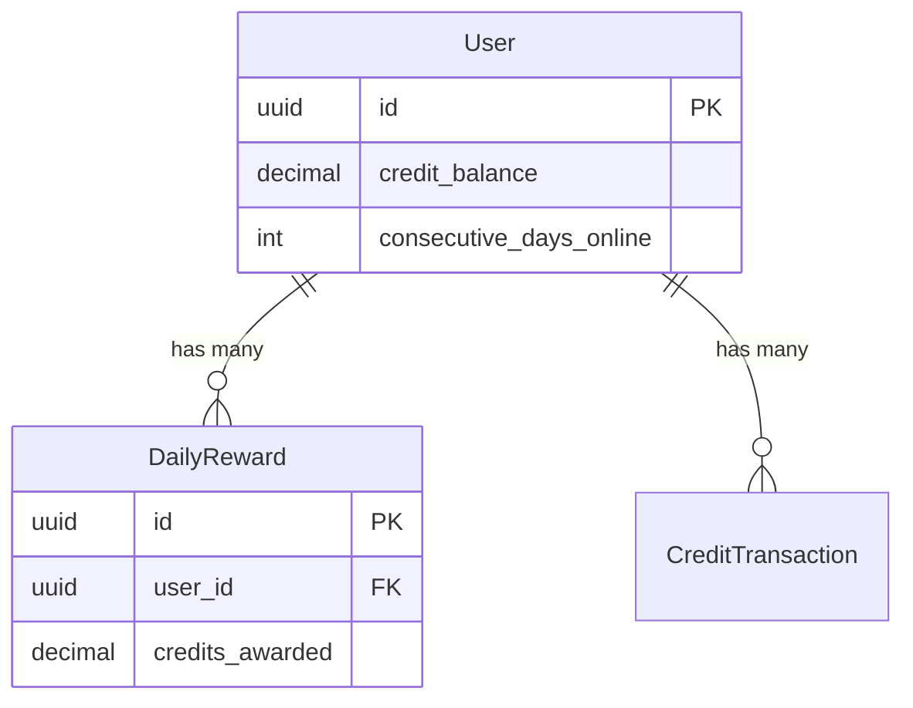
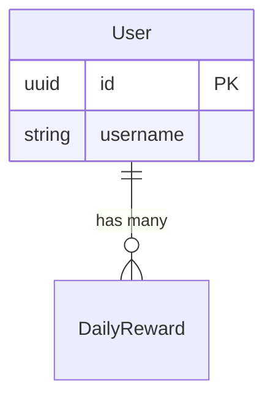
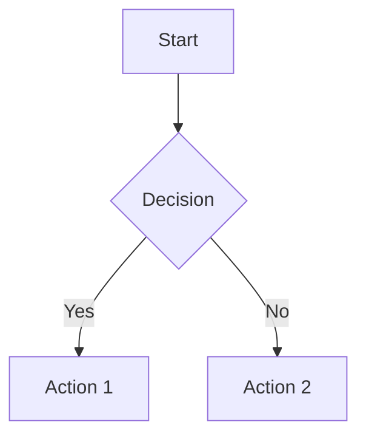
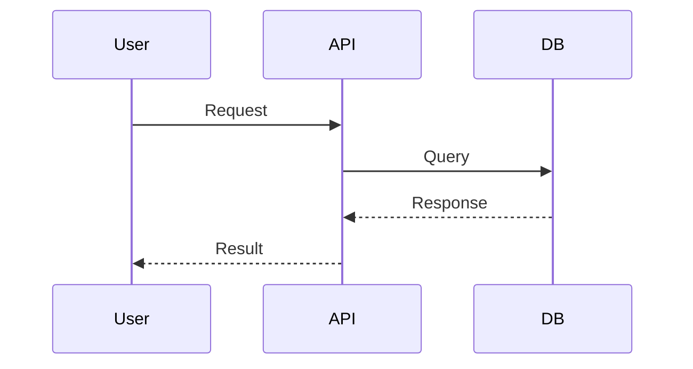

# How to View Mermaid Diagrams

The `CREDIT_ALLOCATION_SCHEMA.md` file contains Mermaid diagrams that need to be rendered to view as visual diagrams. Here are several ways to view them:

---

## 🎯 Option 1: VS Code (Recommended - Easiest)

If you're using **VS Code** (which Cursor is based on), you can view Mermaid diagrams directly:

### Step 1: Install Mermaid Extension

1. Open VS Code/Cursor
2. Press `Ctrl+Shift+X` (or `Cmd+Shift+X` on Mac) to open Extensions
3. Search for: **"Markdown Preview Mermaid Support"** or **"Mermaid Preview"**
4. Install one of these extensions:
   - **Markdown Preview Mermaid Support** by Matt Bierner
   - **Mermaid Preview** by vstirbu
   - **Markdown Preview Enhanced** by Yiyi Wang (most feature-rich)

### Step 2: View the Diagrams

1. Open `CREDIT_ALLOCATION_SCHEMA.md`
2. Press `Ctrl+Shift+V` (or `Cmd+Shift+V` on Mac) to open Markdown Preview
3. The diagrams will render automatically! 🎉

**Alternative:** Right-click on the file → "Open Preview" or "Open Preview to the Side"

---

## 🌐 Option 2: GitHub (If You Push to GitHub)

GitHub automatically renders Mermaid diagrams in Markdown files!

1. Push your code to GitHub
2. Navigate to the file: `CREDIT_ALLOCATION_SCHEMA.md`
3. GitHub will automatically render all Mermaid diagrams

**Example:** If your repo is `github.com/username/thisthat-v3`, go to:
```
https://github.com/username/thisthat-v3/blob/master/CREDIT_ALLOCATION_SCHEMA.md
```

---

## 🔧 Option 3: Online Mermaid Editor

Use the official Mermaid Live Editor:

1. Go to: **https://mermaid.live/**
2. Copy any Mermaid code block from `CREDIT_ALLOCATION_SCHEMA.md`
3. Paste it into the editor
4. See it render instantly!

**Example:** Copy this code block:


---

## 📱 Option 4: Markdown Preview Tools

### Typora (Desktop App)
- Download: https://typora.io/
- Open `CREDIT_ALLOCATION_SCHEMA.md`
- Diagrams render automatically

### Obsidian (Note-taking App)
- Download: https://obsidian.md/
- Open the file in Obsidian
- Mermaid diagrams render natively

---

## 🛠️ Option 5: VS Code Extensions (Detailed)

### Extension: Markdown Preview Enhanced

**Install:**
```bash
# In VS Code/Cursor, install:
code --install-extension shd101wyy.markdown-preview-enhanced
```

**Features:**
- ✅ Renders Mermaid diagrams
- ✅ Exports to PDF/HTML
- ✅ Live preview
- ✅ Math equations support

**Usage:**
1. Open `CREDIT_ALLOCATION_SCHEMA.md`
2. Press `Ctrl+K V` (or right-click → "Markdown Preview Enhanced: Open Preview to the Side")
3. Diagrams render automatically

---

## 📋 Quick Reference: Mermaid Syntax

Mermaid uses simple text-based syntax. Here's how it works:

### Entity Relationship Diagram (ERD)


**Syntax:**
- `||--o{` = One-to-Many relationship
- `{ }` = Entity definition with fields
- `PK` = Primary Key
- `FK` = Foreign Key

### Flowchart


**Syntax:**
- `flowchart TD` = Top-Down flowchart
- `A[Start]` = Rectangle node
- `B{Decision}` = Diamond decision node
- `-->` = Arrow connection
- `|Yes|` = Label on arrow

### Sequence Diagram


**Syntax:**
- `->>` = Solid arrow (request)
- `-->>` = Dashed arrow (response)

---

## 🎨 What Diagrams Are in CREDIT_ALLOCATION_SCHEMA.md?

The file contains **7 different diagrams**:

1. **ER Diagram** - Database schema relationships
2. **Flowchart** - Credit allocation process flow
3. **Formula Graph** - Credit calculation logic
4. **Gantt Chart** - Streak progression timeline
5. **Class Diagram** - Table structure details
6. **Sequence Diagram** - API call flow
7. **Graph Diagram** - Credit sources and sinks

---

## 💡 Pro Tips

### Tip 1: Export Diagrams
If using **Markdown Preview Enhanced**:
- Right-click on diagram → "Export Diagram"
- Save as PNG, SVG, or PDF

### Tip 2: Edit Diagrams
- Edit the Mermaid code directly in the `.md` file
- Preview updates automatically
- Use Mermaid Live Editor to test changes

### Tip 3: Copy Individual Diagrams
Each diagram is in its own code block:
```markdown
```mermaid
...diagram code...
```
```

Copy just the code block to share or edit separately.

---

## 🚀 Quick Start (Fastest Method)

**For immediate viewing:**

1. **Open:** `CREDIT_ALLOCATION_SCHEMA.md` in VS Code/Cursor
2. **Install Extension:** "Markdown Preview Enhanced" (one-click install)
3. **Press:** `Ctrl+K V` to open preview
4. **Done!** ✅ Diagrams render automatically

---

## 📚 Learn More About Mermaid

- **Official Docs:** https://mermaid.js.org/
- **Live Editor:** https://mermaid.live/
- **Examples:** https://mermaid.js.org/ecosystem/tutorials.html
- **Syntax Guide:** https://mermaid.js.org/intro/syntax-reference.html

---

## 🔍 Troubleshooting

### Diagrams Not Rendering?

1. **Check Extension:** Make sure Mermaid extension is installed
2. **Check Syntax:** Mermaid code blocks must start with ` ```mermaid`
3. **Try Online:** Use https://mermaid.live/ to test if code is valid
4. **Restart:** Restart VS Code/Cursor after installing extension

### Want to Edit Diagrams?

1. Edit the Mermaid code directly in the `.md` file
2. Use Mermaid Live Editor to test changes
3. Copy back to the file when done

---

**Last Updated:** 2025-01-XX  
**Status:** ✅ Ready to Use


